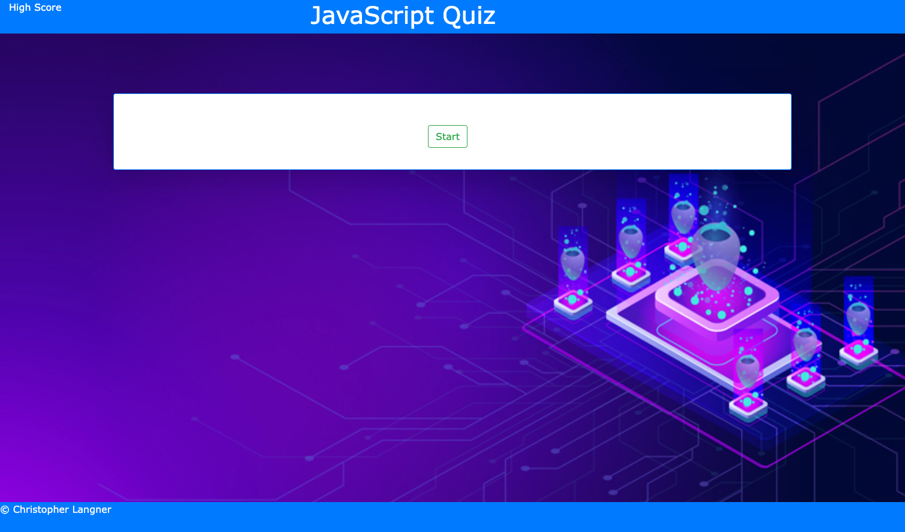

# js-quiz

## user story

AS A coding boot camp student
I WANT to take a timed quiz on JavaScript fundamentals that stores high scores
SO THAT I can gauge my progress compared to my peers

## acceptance Criteria

GIVEN I am taking a code quiz
WHEN I click the start button
THEN a timer starts and I am presented with a question
WHEN I answer a question
THEN I am presented with another question
WHEN I answer a question incorrectly
THEN time is subtracted from the clock
WHEN all questions are answered or the timer reaches 0
THEN the game is over
WHEN the game is over
THEN I can save my initials and score

Repo: https://github.com/rehpotsirhc21/js-quiz

# resources:

The below links were used as reference to help build out different pieces.
 ## This youtube video helped with creation of the timer and related functions 
  https://www.youtube.com/watch?v=x7WJEmxNlEs

## questions/answers are modified versions of the Q and A located here.
https://www.w3schools.com/js/js_quiz.asp
 
## This is a similar project on youtube. I built this out seperatly and applied the concepts from it in my final code
 https://www.youtube.com/watch?v=riDzcEQbX6k&t=1119s

## background from: https://www.freellustrations.com/illustration/NTcp

